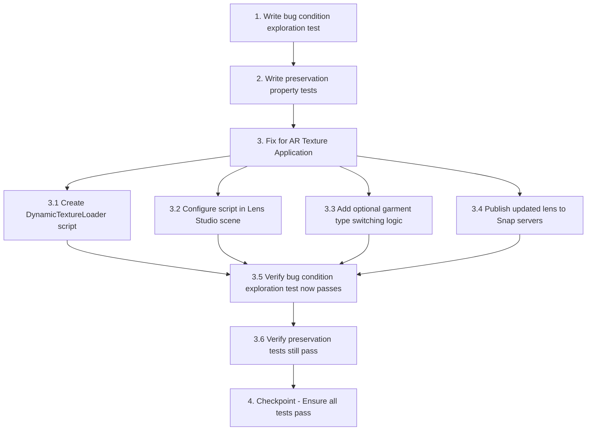

# Implementation Plan

## Overview

This implementation plan follows the bugfix workflow using the bug condition methodology. The plan is structured in three phases:

1. **Exploration Phase**: Write a property-based test that demonstrates the bug exists (test will fail on unfixed code)
2. **Preservation Phase**: Write property-based tests that capture existing behavior to prevent regressions
3. **Implementation Phase**: Fix the bug by adding a DynamicTextureLoader script to the Snap Lens Studio project

The fix addresses the issue where custom textures uploaded by users are not applied to the AR clothing models in the Snap Lens view. The root cause is a missing script in the Lens Studio project that reads `launchParams` and applies dynamic textures.

## Tasks

- [ ] 1. Write bug condition exploration test
  - **Property 1: Bug Condition** - Snap Lens Ignores Dynamic Texture Parameters
  - **CRITICAL**: This test MUST FAIL on unfixed code - failure confirms the bug exists
  - **DO NOT attempt to fix the test or the code when it fails**
  - **NOTE**: This test encodes the expected behavior - it will validate the fix when it passes after implementation
  - **GOAL**: Surface counterexamples that demonstrate the bug exists
  - **Scoped PBT Approach**: For deterministic bugs, scope the property to the concrete failing case(s) to ensure reproducibility
  - Test that when a valid texture URL and garment type are passed via `launchParams` to the Snap Lens, the lens currently ignores these parameters and displays default white texture
  - Test implementation details from Bug Condition in design:
    - Input: `{ textureUrl: "https://backend.com/textures/texture-abc.png", garmentType: "tshirt", lensHasScript: false }`
    - Verify `applyLens` is called with correct `launchParams`
    - Verify lens displays default white texture (not the custom texture)
    - Verify Lens Studio Logger Panel shows NO messages about reading `launchParams`
  - The test assertions should match the Expected Behavior Properties from design:
    - After fix: lens SHALL fetch texture from URL using `RemoteMediaModule`
    - After fix: lens SHALL apply texture to target garment material
    - After fix: lens SHALL display custom texture in AR view
  - Run test on UNFIXED code
  - **EXPECTED OUTCOME**: Test FAILS (this is correct - it proves the bug exists)
  - Document counterexamples found to understand root cause:
    - Example 1: Upload floral dress → Backend returns texture URL → Lens shows white texture
    - Example 2: Upload striped sweatshirt → Frontend passes URL → Lens ignores URL
    - Example 3: Select "hoodie" → Frontend passes `garment: "hoodie"` → Lens shows default shirt
  - Mark task complete when test is written, run, and failure is documented
  - _Requirements: 1.1, 1.2, 1.3, 1.4_

- [ ] 2. Write preservation property tests (BEFORE implementing fix)
  - **Property 2: Preservation** - Non-Dynamic Lens Behavior Unchanged
  - **IMPORTANT**: Follow observation-first methodology
  - Observe behavior on UNFIXED code for non-buggy inputs (backend processing, Camera Kit initialization, photo capture, texture storage)
  - Write property-based tests capturing observed behavior patterns from Preservation Requirements:
    - Backend texture extraction generates 1024x1024 seamless PNG textures
    - Backend saves textures to `backend/public/textures/` with UUID filenames
    - Camera Kit session initializes correctly and applies base lens
    - Photo capture captures canvas content and allows download
    - LensStudioAR component displays static lens without custom textures
    - Texture metadata is saved to MongoDB user document
    - ARTryOn component overlays textures on video feed
  - Property-based testing generates many test cases for stronger guarantees
  - Run tests on UNFIXED code
  - **EXPECTED OUTCOME**: Tests PASS (this confirms baseline behavior to preserve)
  - Mark task complete when tests are written, run, and passing on unfixed code
  - _Requirements: 3.1, 3.2, 3.3, 3.4, 3.5, 3.6, 3.7_

- [ ] 3. Fix for AR Texture Application

  - [ ] 3.1 Create DynamicTextureLoader script in Snap Lens Studio
    - Open the Snap Lens Studio project (`.lsproj` file)
    - Create a new JavaScript script resource named `DynamicTextureLoader.js`
    - Implement script logic to:
      - Read `texture_url` and `garment` from `global.launchParams`
      - Use `RemoteMediaModule` to fetch the texture from the URL
      - Apply the fetched texture to the target material's `baseTex` property
      - Log all steps for debugging (initialization, parameter reading, texture loading, application)
    - Add retry logic: Implement an UpdateEvent loop that retries reading `launchParams` for up to 60 frames (1 second) in case parameters arrive after lens initialization
    - Add error handling: Implement try-catch blocks and fallback behavior for:
      - Missing `launchParams`
      - Invalid texture URLs
      - CORS errors
      - Texture load failures
      - Missing target material
    - _Bug_Condition: isBugCondition(input) where input.textureUrl IS_VALID_URL AND input.garmentType IN ['tshirt', 'sweatshirt', 'hoodie', 'dress', 'leggings', 'shorts'] AND input.lensHasScript == false AND applyLensCalled(input.textureUrl, input.garmentType)_
    - _Expected_Behavior: For any input where a valid texture URL and garment type are passed via launchParams, the fixed lens SHALL fetch the texture from the URL using RemoteMediaModule, apply it to the target garment material, and display the custom texture in the AR view_
    - _Preservation: All inputs that do NOT involve the Snap Lens receiving dynamic textures should be completely unaffected by this fix (backend texture processing, Camera Kit initialization, photo capture, static lens usage, texture metadata storage)_
    - _Requirements: 2.1, 2.2, 2.3, 3.1, 3.2, 3.3, 3.4, 3.5, 3.6, 3.7_

  - [ ] 3.2 Configure script in Lens Studio scene
    - Attach the `DynamicTextureLoader` script to the Camera object in the Lens Studio scene hierarchy
    - In the script's Inspector properties, assign the garment mesh's material to the `targetMaterial` input field
    - Ensure the script's `parameterName` input is set to `"texture_url"` (default)
    - Verify the script is properly configured and ready to receive `launchParams`
    - _Requirements: 2.1, 2.2, 2.3_

  - [ ] 3.3 Add optional garment type switching logic (if multiple models exist)
    - If the lens contains multiple 3D garment models (shirt, dress, hoodie), add logic to:
      - Read the `garment` parameter from `launchParams`
      - Show/hide the appropriate 3D model based on the garment type
      - Apply the texture to the active model's material
    - If only one garment model exists, skip this step
    - _Requirements: 2.4_

  - [ ] 3.4 Publish updated lens to Snap servers
    - Publish the updated lens with the `DynamicTextureLoader` script to Snap's servers
    - Verify the lens is published successfully and available for use
    - Note the lens ID for frontend integration (should be the same as existing lens)
    - _Requirements: 2.1, 2.2, 2.3_

  - [ ] 3.5 Verify bug condition exploration test now passes
    - **Property 1: Expected Behavior** - Dynamic Texture Application Works
    - **IMPORTANT**: Re-run the SAME test from task 1 - do NOT write a new test
    - The test from task 1 encodes the expected behavior
    - When this test passes, it confirms the expected behavior is satisfied
    - Run bug condition exploration test from step 1
    - **EXPECTED OUTCOME**: Test PASSES (confirms bug is fixed)
    - Verify test cases now pass:
      - Upload solid color shirt → AR view shows custom texture
      - Upload striped sweatshirt → AR view shows stripes
      - Upload floral dress → AR view shows floral pattern
      - Lens Studio Logger Panel shows messages like "Texture URL = [URL]", "Texture loaded successfully!", "Texture applied successfully!"
    - _Requirements: 2.1, 2.2, 2.3_

  - [ ] 3.6 Verify preservation tests still pass
    - **Property 2: Preservation** - Non-Dynamic Lens Behavior Unchanged
    - **IMPORTANT**: Re-run the SAME tests from task 2 - do NOT write new tests
    - Run preservation property tests from step 2
    - **EXPECTED OUTCOME**: Tests PASS (confirms no regressions)
    - Confirm all tests still pass after fix:
      - Backend texture processing generates 1024x1024 seamless textures
      - Backend saves textures with UUID filenames
      - Camera Kit session initializes correctly
      - Photo capture works correctly
      - LensStudioAR component displays static lens
      - Texture metadata is saved to MongoDB
      - ARTryOn component overlays textures on video feed
    - _Requirements: 3.1, 3.2, 3.3, 3.4, 3.5, 3.6, 3.7_

- [ ] 4. Checkpoint - Ensure all tests pass
  - Run all tests (bug condition exploration test + preservation tests)
  - Verify all tests pass
  - Test full integration flow:
    - Upload image → Backend processes → Frontend passes to lens → Lens applies texture → User sees custom texture in AR
    - Switch between garment types and verify texture is applied to each
    - Capture photo with custom texture and verify download works
    - Test error scenarios: invalid URL, CORS error, network failure → verify graceful fallback to default texture
  - If any issues arise, ask the user for guidance
  - _Requirements: All requirements (1.1-1.4, 2.1-2.4, 3.1-3.7)_

## Task Dependency Graph

## Notes

- **Lens Studio Access Required**: This fix requires access to the Snap Lens Studio project file (`.lsproj`). Ensure you have the project file and Lens Studio installed.
- **Script Reference**: Refer to `LENS_DYNAMIC_TEXTURE_SCRIPT.md` documentation for the complete DynamicTextureLoader script implementation.
- **Testing Approach**: The bug condition test is expected to FAIL on unfixed code - this confirms the bug exists. After implementing the fix, the same test should PASS.
- **Preservation Testing**: Use property-based testing for preservation checks to generate many test cases and catch edge cases automatically.
- **Error Handling**: The DynamicTextureLoader script includes comprehensive error handling for missing parameters, invalid URLs, CORS errors, and texture load failures.
- **Retry Logic**: The script implements a 60-frame (1 second) retry loop to handle cases where `launchParams` arrive after lens initialization.
- **No Frontend/Backend Changes**: This fix is entirely on the Lens Studio side. The frontend and backend are already correctly configured.
